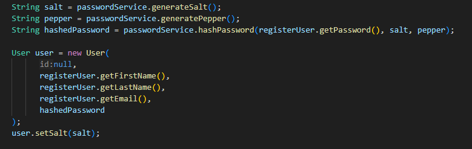
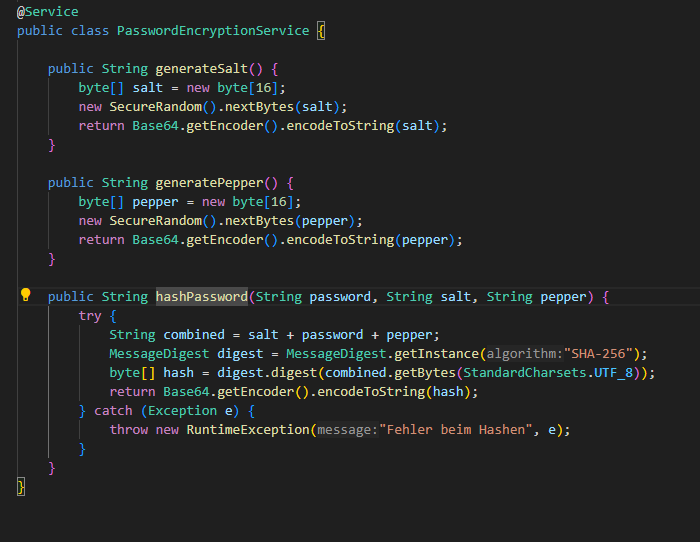
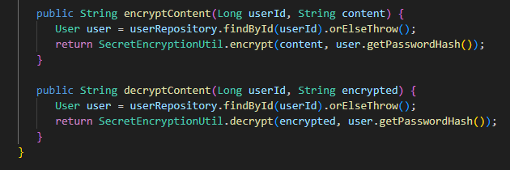

# Sicherheits-Erweiterung der Tresor-Applikation

## Ziel der Erweiterung

Die bestehende Tresor-Applikation wurde um Sicherheitsmechanismen erweitert. Ziel ist es, Benutzerdaten (Passwörter) und sensitive Inhalte (Secrets) gemäss modernen Sicherheitsstandards zu schützen.

## Recherchen & Grundlagen

### Passwort-Hashing

- Verwendetes Verfahren: SHA-256
- Eingesetzt mit: **Salt** (pro User) + **Pepper** (global)
- Warum?
  - Schutz gegen Rainbow-Tables
  - Einweg-Hashfunktion (nicht zurückrechenbar)
  - Standard für sichere Speicherung

### AES-Verschlüsselung (Secrets)

- Algorithmus: AES (Advanced Encryption Standard)
- Schlüsselbasis: Benutzerabhängig → abgeleitet aus `passwordHash`
- Warum?
  - Schutz sensibler Inhalte (Secrets)
  - Nur Benutzer selbst kann entschlüsseln
  - Sicher auch bei Datenleak

## Technische Umsetzung

### Passwort-Hashing

**Ablauf:**

1. Passwort kommt im `UserController` als Klartext an
2. `UserServiceImpl` erzeugt Salt
3. Kombiniert: `salt + password + pepper`
4. SHA-256 Hash wird berechnet
5. Base64-Hash + Salt werden in DB gespeichert

### AES Secret Encryption

**Ablauf:**

1. Secret wird vom User an den `SecretController` gesendet
2. `SecretServiceImpl` ruft `encryptContent(...)` auf
3. `SecretEncryptionUtil` erzeugt AES-Key via SHA-256 aus `passwordHash`
4. Secret wird verschlüsselt und gespeichert
5. Beim Abrufen wird es mit dem gleichen Key wieder entschlüsselt

### Risiken und Schutzmassnahmen

| Risiko                      | Auswirkung                                 | Empfehlung                                  |
|----------------------------|---------------------------------------------|---------------------------------------------|
| Datenbank-Leak             | Zugriff auf gehashte Passwörter und Secrets | Salt + Pepper + sichere Speicherung         |
| Code-Leak (Pepper sichtbar)| Angreifer kann Hash-Rekonstruktion versuchen| Pepper auslagern in `.env` oder Config-Datei|
| Brute-Force auf Login      | Viele Passwort-Versuche durch Bots möglich  | Rate-Limiting oder Captcha einbauen         |
| Fehlende Verschlüsselung   | Secrets sind im Klartext lesbar             | AES-Verschlüsselung mit Benutzerschlüssel   |
| Unsichere Key-Verwaltung   | Einheitlicher Schlüssel für alle Users      | Schlüssel aus Benutzerdaten individuell ableiten |